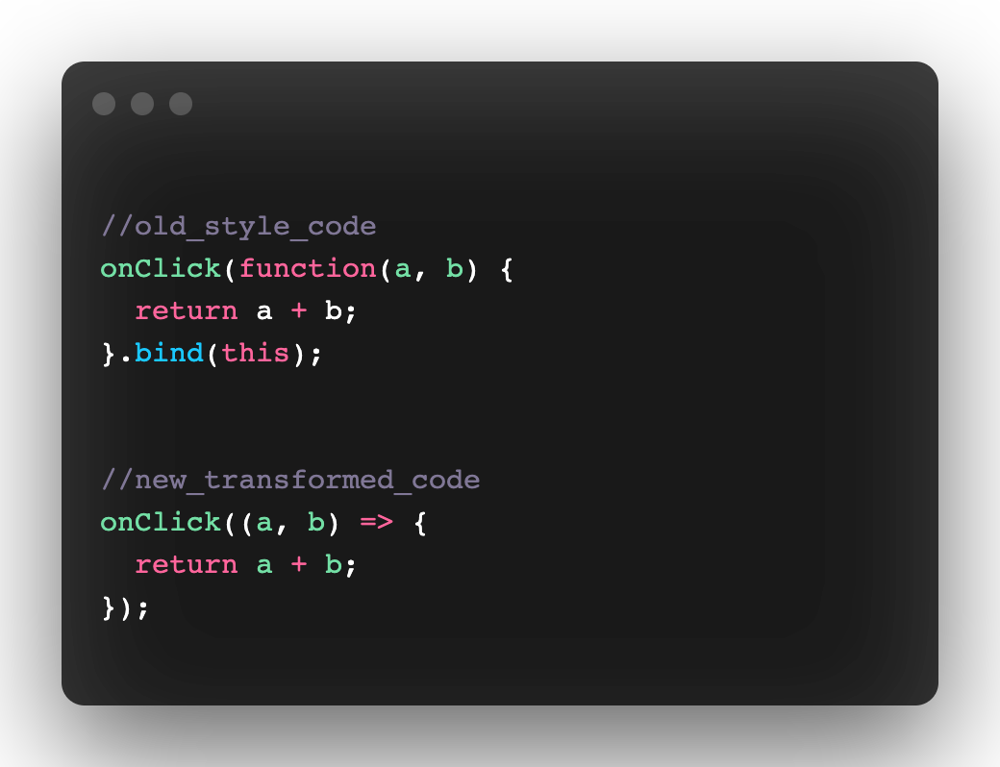
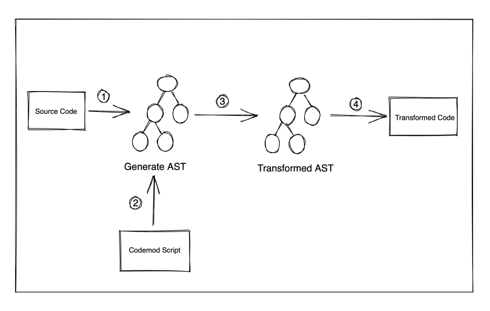
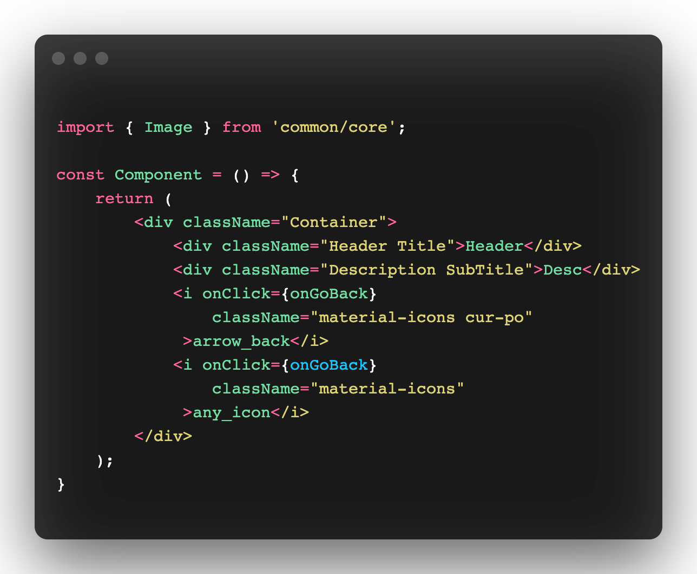
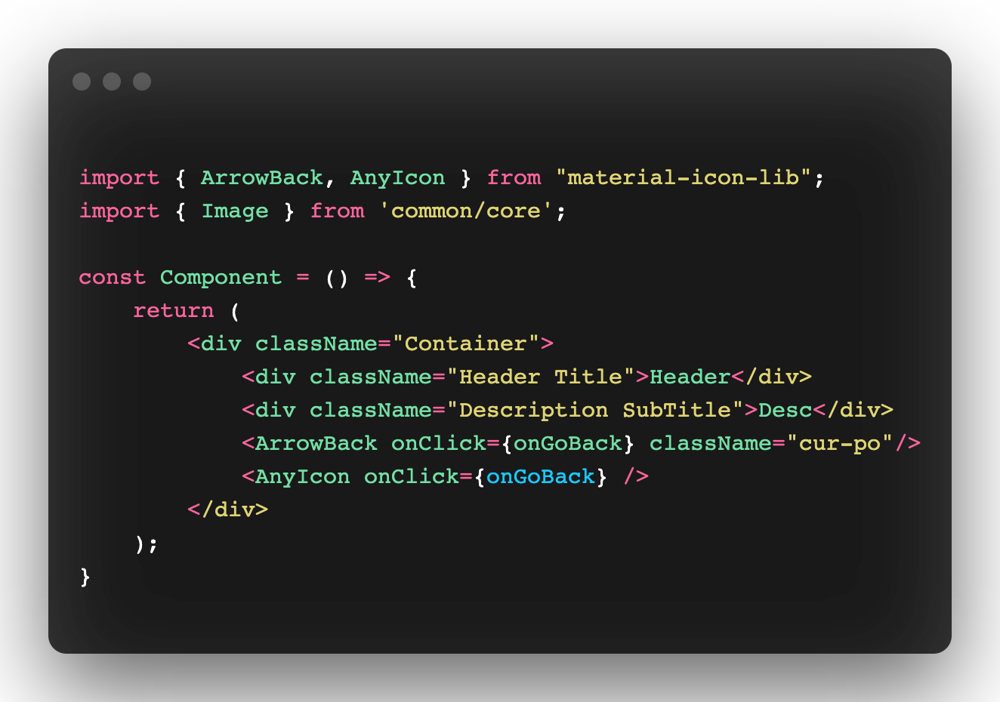

Yes…we will be talking about codemods, what are codemods and how to write a transformation script?

Codemod may be a tool or a library that assists to do large-scale codebase refactoring that can be partially automated but still require human intervention.

Here is an example for you.



We need to transform the old-style ‘this’ binding to arrow functions. But we need to do this in a large-scale codebase say thousand of files. This might take days to do manually.
What if we can write a script that takes this code as data, processes them and returns the transformed code. This process is called _metaprogramming_.

---
Let’s go through the theory once. This is what your script needs to do
* Read your old source code.
* Parse it and create an abstract syntax tree (AST).
* Apply the transformation on AST.
* Reconstruct source code from transformed AST and replace the original code.



Remember your compiler design classes, AST is the final result of the syntax analysis phase. You can read more about it [here](https://medium.com/basecs/leveling-up-ones-parsing-game-with-asts-d7a6fc2400ff).

Whoops… that's a lot of work. Don’t worry, we have tools that will handle all the low-level work for us. We will be using an awesome tool called [jscodeshift](https://github.com/facebook/jscodeshift).

jscodeshift is a wrapper around [recast](https://github.com/benjamn/recast) which is an AST to AST transformer. It also let us know how many files have been transformed or skipped.

---

So now let’s get our hands dirty. We have font icons tags with a material-icons class attached. We need to migrate from font icons to SVG icons.



Our final result will look something like this.



In the transformed code 'i' tag is replaced with respective SVG icon components. Previous className and other props are still attached with the new SVG component. We also have an import statement from our icon library.

These transformations have been applied to thousands of javascript and typescript files in a real project.̉̉̉̉̉̉

You first need to install jscodeshift.

```bash
npm install -g jscodeshift
```

Here is final script.

```js
//jscodeshift -t scripts/index.js src/**/*.(js|tsx) --parser tsx

export default function transformer(file, api) {
  
  // jscodeshift cli will run this transformer function with two parameters.
  // file: our initial source code
  // api: an object exposes jscodeshift library and helper functions
  const j = api.jscodeshift;

  // keep root of our source code AST
  const root = j(file.source);
  
  const iconImports = [];
  const exportPath = "material-icon-lib";

  // We are looking for a JSX element which has openingElement as 'i'
  // <i className="material-icon">arrow_back</i>
  
  // root.find will traverse the tree and returns the list of paths all JSX Elements
  root.find(j.JSXElement).forEach((path) => {
    // Path also contains information about parentPath for other use cases
    const { node } = path;
    const openingElement = node.openingElement;

    if (openingElement.name.name === "i") {
      const iconSnakeCaseName = node.children[0].value;
      // <i className="material-icon">arrow_back</i>
      // iconSnakeCaseName => arrow_back
      
      let attributes = openingElement.attributes;

      // Normalize icon name to get transformed opening element name
      // arrow_back => ArrowBack
      const iconPascalCaseName = iconSnakeCaseName
        .split("_")
        .map((txt) => txt.charAt(0).toUpperCase() + txt.substr(1).toLowerCase())
        .join("");

      // Push this icon entry in import list
      iconImports.push(iconPascalCaseName);

      // Remove 'material-icons ' from className value
      
      // We are looking for a attribute which has 'className' name
      // Replace the current className value and remove the attribute
      // if value becomes empty.
      const classNameAttribute = attributes.find(
        (attribute) => attribute.name.name === "className"
      );

      const classValues = classNameAttribute.value.value;

      if (classNameAttribute && typeof classValues === "string") {
        const classNamePropValue = classValues
          .replace("material-icons ", "")
          .replace("material-icons", "");
        classNameAttribute.value.value = classNamePropValue;

        // remove className props is value is empty
        if (!classNamePropValue.trim()) {
          attributes = attributes.filter(
            (attribute) => attribute.name.name !== "className"
          );
        }
      }

      // Create new Icon component with old attributes
      // jsxElement returns generated SVG icon component.
 
      const svgIconComponent = j.jsxElement(
        j.jsxOpeningElement(
          j.jsxIdentifier(iconPascalCaseName),
           attributes,
            /*selfClosing*/ true
        )
      );

      // Replace the <i/> node with svgIconComponent node
      j(path).replaceWith(svgIconComponent);
    }
  });

  // Create import statement for all used icon components
  const importSpecifiers = [...new Set(iconImports)].map(
    (icon) => j.importSpecifier(j.identifier(icon))
    );

  if (importSpecifiers.length) {
    const newImport = j.importDeclaration(
      importSpecifiers,
       j.stringLiteral(exportPath)
    );

    // Add this import statement on the top of source body
    root.get().node.program.body.unshift(newImport);
  }
  
  // Return source code of transformed AST
  return root.toSource();
}
```

You can explore more and play with this example [here](https://astexplorer.net/#/gist/a5393f15d301631e8512bfd2830fe2d4/ba2789798e456b451dde09a343cf19c9a988a1ce).
Try exploring the source code of some popular codemods like [loadable-component](https://github.com/gregberge/loadable-components/blob/main/packages/codemod/README.md), [react-codemod](https://github.com/reactjs/react-codemod) and many more.

## Ending Notes
Most of the codemod works the same way. The key is to understand the generated AST of your language. Now you might guess how Babel transforms modern javascript for old browsers, how eslint/prettier checks for linting errors and many more.
I’m excited about what you build out of these tools.

## Resources
Here are some sources to get started with codemods.
* [Levelling Up One’s Parsing Game With ASTs](https://medium.com/basecs/leveling-up-ones-parsing-game-with-asts-d7a6fc2400ff)
* [Metaprogramming in JavaScript with jscodeshift](https://medium.com/onfido-tech/metaprogramming-in-javascript-with-jscodeshift-8c72ae56759c)
* [List of awesome codemods](https://opensourcelibs.com/lib/awesome-codemods)
* [Codeshift Docs](https://www.codeshiftcommunity.com/docs/)
