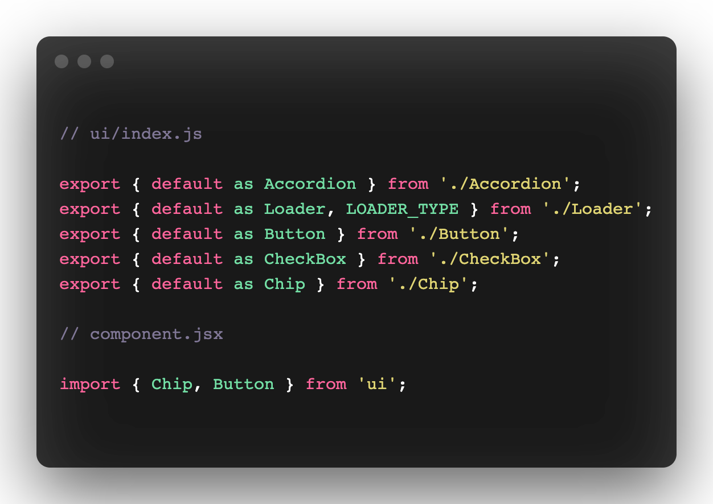
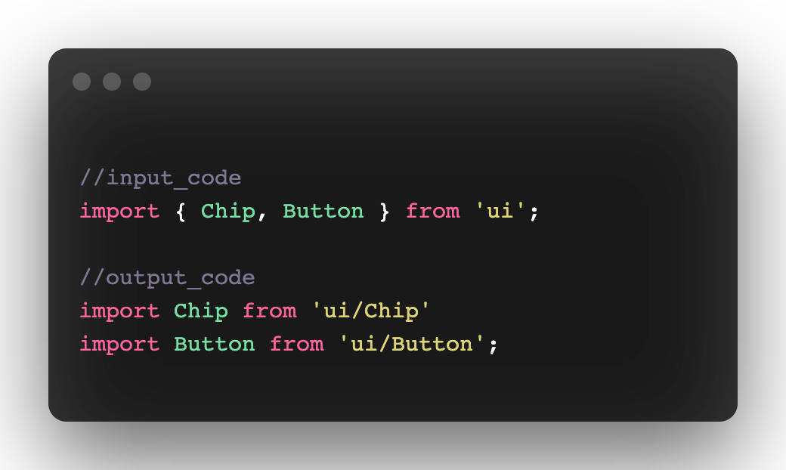
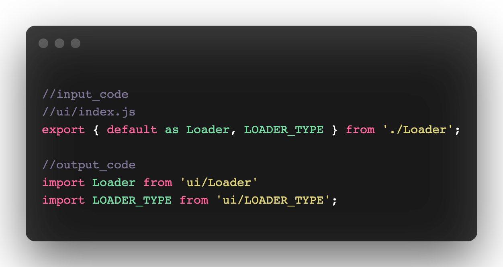
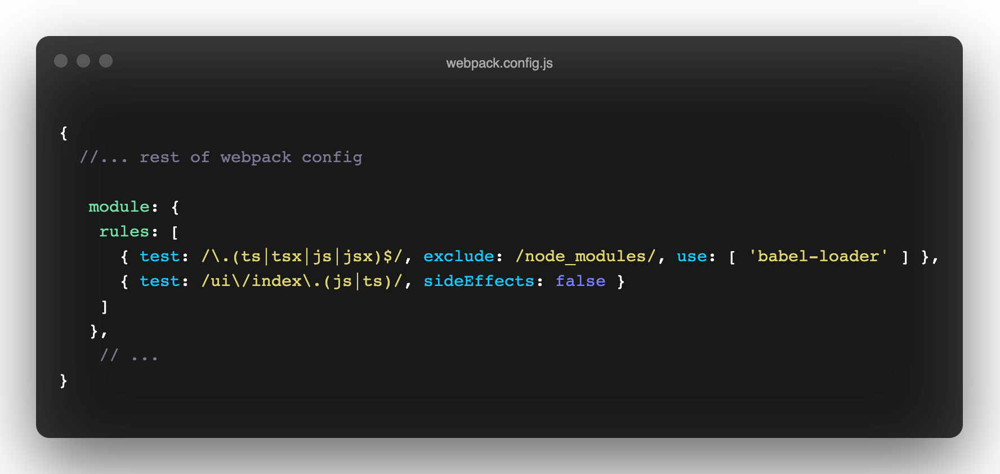
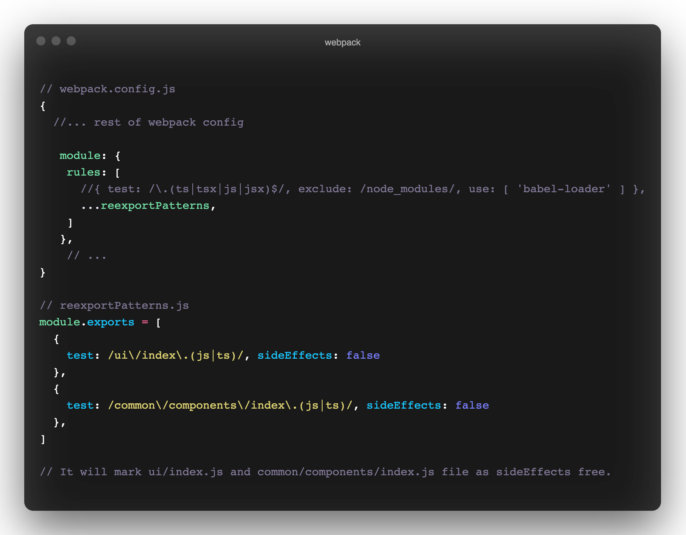

import { Tweet } from 'mdx-embed'

Re-exporting a lot of components from a single file is a pattern followed by many developers to organise their codebase. It makes it easy to import these components into other files.

Here is an example of a re-export file. In this example, the _index.ts_ file inside ‘ui’ folder is just importing and then exporting all the components inside ‘ui’ directory. Now we can import these components directly from this _ui/index.ts_ in the Component.ts file.

I was just going through my Twitter feeds when I came across this tweet from Ivan Akulov.

<Tweet tweetLink="iamakulov/status/1331551351214645251" align="center"/>

 

In simple words, re-export is bad for web performance since even if you are importing a single component, all other unused components are added to that chunk.

You might be thinking tree-shaking should work here. Yes, it does. But it only removes the components which are not being used in the whole app.

I found this problem in many javascript chunks and began to hunt down a solution.

**The first** but not very good solution was to avoid it. Just remove this re-export file and use absolute import for each component. This was an easy fix but it increases the length of import statements and wasn’t very scalable.

**The second** solution was to transform the import statement at compile time using [babel-plugin-transform-imports](https://www.npmjs.com/package/babel-plugin-transform-imports).

This was a good solution for easy imports. But as soon as your re-export file gets complicated, the transform plugin gets difficult to maintain.

You might need to tweak the plugin a little bit or write your transform function to make it work but still complicated stuff.

---

Now about the **final solution**, I found.
Before that read the reply from webpack’s maintainer for this tweet.

<Tweet tweetLink="wSokra/status/1331909789207638017" align="center"/>

 

“sideEffects: false” tells Webpack that none of the files has side effects and all of them are tree shakable. This means if some code is dead (not being used), Webpack should remove it.
So the key is to mark this re-export file as sideEffects free.

Now the question is how should one implement this in our web app?

In _webpack.config.js_, we can find module property in which we can write rules about the specific types of files.

Yes, rules about specific files. That’s all we want. We want to mark the sideEffects flag as false for specific files. Here is how it is implemented.

In the _test_ field, we need to write a regex to match the file path structure. So that while bundling if webpack encounters any file whose path is matched with this regex, it will mark it as sideEffects free.

You might have many re-export files with different path patterns. You can create a separate file for these cases.

It is an easy to implement and scalable solution for this issue. The sideEffects flags enable aggressive tree-shaking and only add the imported components.

## Ending Notes
Enabling tree-shaking for re-export files only includes imported code in the current chunk. This reduces that chunk size. So less JS is being sent to the client, less code needs to transfer over the internet, the browser needs to parse and execute less JS which improve overall page performance.

PS: Above analysis is based on webpack v4. Webpack 5 might have some improvement for this issue, not yet explored.
